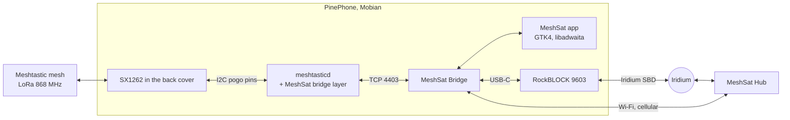

<picture>
  <source media="(prefers-color-scheme: dark)" srcset="docs/images/mark-dark.png">
  
</picture>

### MeshSat for Linux phones: your Meshtastic node over Bluetooth or the LoRa back cover, the Bridge in your pocket, one package.

[Install](docs/INSTALL.md) ·
[The node](https://github.com/meshsat/meshsat-lora-backplate) ·
[The Bridge](https://github.com/meshsat/meshsat) ·
[What is proven](#what-is-proven-and-what-is-not) ·
[meshsat.net](https://meshsat.net)

A Linux phone with the MeshSat Bridge on it is a router between a Meshtastic mesh, a satellite modem and the MeshSat Hub, the way a phone with MeshSat Android or iOS is: it adopts a Meshtastic node over Bluetooth, and a PinePhone with the Pine64 LoRa back cover is a node by itself, which the package notices and uses without being asked. This repository packages all of it for Linux phones: one `.deb`, installed with one command, and the MeshSat app in the phone's app grid, the same screens as MeshSat Android and iOS.

> **Status: pre-release.** This is a prototype under active development, not a finished product. The node and the Bridge are proven on one phone on one bench, at **0 dBm only**: the back cover's radio runs on a plain crystal that drifts as the amplifier heats, so long frames fail from 5 dBm up and the phone cannot receive for some seconds after each transmission. A radio that stops answering has to be re-seated by hand. The package has never been installed by anyone but its authors and has never been used in an actual emergency. See [What is proven, and what is not](#what-is-proven-and-what-is-not) before you rely on it for anything.

## How it fits together

## What is here

- [`docs/INSTALL.md`](docs/INSTALL.md): the one command, the optional Hub key and satellite modem, what the node does and does not do.
- `app/meshsat/`: the MeshSat app, Python with GTK 4 and libadwaita: the screens of [MeshSat Android](https://github.com/meshsat/meshsat-android) and [iOS](https://github.com/meshsat/meshsat-ios) (Home, Messages, Map, People, Setup and its pages) drawn natively for a phone in the hand, with the same colour tokens, type (IBM Plex), Material icons, words and measures (written in the Android app's dp and scaled once, 1 dp = 0.9 px on a 360 px screen; `MESHSAT_APP_SCALE` changes it), night mode as the same red-only colour matrix over the whole window, and the map on OpenStreetMap tiles through the Android app's dark-tile matrix (libshumate); satellite passes are the Bridge's predictions for the phone's position (geoclue, the node, or a position typed in) drawn as the Android chart; SMS is the phone's own SIM through the Bridge's ModemManager transport (the lane, the chats, the SOS to the emergency contacts); a mesh node is "Node !id" until the phone has heard its name, as on the other apps, is asked for it again on the cadence its firmware accepts, and a name heard once is kept by the app across restarts of the Bridge. It reads the Bridge's API on `127.0.0.1:6050` and never opens the node's own port. Its tabs and pages open over D-Bus (`gapplication action net.meshsat.Bridge tab "'map'"`, `open "'satellite'"`, `night`), which is how `tools/capture-phone.sh` takes the parity captures. The icon in the app grid, the `.desktop` entry and the AppStream metadata are under `package/`.
- `package/`: the Debian package's control files, maintainer scripts and static files; `build-deb.sh` assembles the package from the node sources of [meshsat-lora-backplate](https://github.com/meshsat/meshsat-lora-backplate) at a pinned commit, a daemon built on a phone from [meshsat-firmware](https://github.com/meshsat/meshsat-firmware), the Bridge out of [meshsat](https://github.com/meshsat/meshsat)'s container image (`fetch-bridge.sh`), and Meshtastic's web client release. No gateway logic lives here.
- `app/meshsat/notify.py` (`meshsat-notify`, a user service of the session): MeshSat outside its window. The notifications MeshSat Android posts, in its words (a text that arrived, a message that did not go, an SOS in progress with **Cancel SOS**, and the satellite signal as one notification kept up to date, "Iridium signal 3/5"); `net.meshsat.Status` on the session bus for whatever draws the radios' state outside the app; a tray icon where the shell has a tray (Plasma Mobile, desktops).
- `phosh-plugins/`: MeshSat in Phosh, Mobian's shell, whose top bar takes no icons from applications: a tile among the quick settings ("Mesh: 2 nodes", or the satellite's bars and "Satellite: 3/5"; a tap opens the app) and a widget on the lock screen. Built on a phone by `phosh-plugins/build.sh` (GTK 3's headers and nothing of Phosh: the tile finds Phosh's types by name when Phosh loads it); Phosh finds them at its next start after the install.
- `tools/`: `capture-phone.sh` (the captures above), `vector2svg.py` (Android vector drawables to the SVG icons the app ships), `make-signal-icons.py` (the six satellite signal icons), and three bench tools: `phone-touch.py` (real touch gestures on the phone's touchscreen, for screenshots of what only a finger opens), `stand-in-status.py` (what the notifier says with a modem at N bars, on a phone without one) and `lockscreen-widget-test.py` (the lock-screen widget in a window of its own).
- The package's units: `meshsat-hardware.service` (at boot, and again when the app asks: is the LoRa back cover on this phone? then `/run/meshsat/hardware.env` tells the Bridge to use its daemon over TCP, otherwise to adopt a node over Bluetooth, and the daemon and the watchdog stay off), `meshtasticd.service` (the node, only with the cover), `meshsat-radio-watch.timer` (the watchdog that tells a user to re-seat a cover whose radio stopped answering, and starts the node again when it answers), `meshsat-bridge.service` (the Bridge). In Bluetooth mode the app's Setup > Your MeshSat node scans for Meshtastic nodes, pairs with the PIN the node shows, and the Bridge keeps the node across restarts; `/etc/meshsat/hardware.conf` with `MESHSAT_NODE=bluetooth` makes a phone with a cover use a node over Bluetooth anyway.

## What is proven, and what is not

| | State |
|---|---|
| The package installs with one command on a Mobian PinePhone Pro and starts the node, the watchdog and the Bridge | **Yes**, 28 Sep 2026: `sudo apt install ./meshsat_0.2.0_arm64.deb`, exit 0, the three units active, `Final Tx power: 0 dBm`, the node's identity carried over; every upgrade since 0.1.0 too |
| The MeshSat icon in the app grid opens the app, with the Android and iOS apps' screens | **Yes**, 28 Sep 2026: the owner used the first native build on the bench phone and had its scale, icon and map corrected the same day; 0.2.0's captures of every screen are in the release notes |
| Messages typed in the app reach a T-Deck, and a T-Deck's texts show in the app | **Yes** for the Bridge underneath (28 Sep 2026, over its API); the app's composer sends through the same call, **not yet exercised by a person** |
| A phone without the cover adopts a Meshtastic node over Bluetooth | **Yes**, 28 Sep 2026, on the bench PinePhone Pro with the cover overridden (`MESHSAT_NODE=bluetooth`): scan, pairing with the PIN a T-Deck showed, link up in 20 s, the T-Deck's six nodes listed; a text sent through the Bridge went out through the T-Deck, a text from another node over LoRa reached the phone through it; after a restart of the Bridge the node was adopted again by itself. **One phone, one node**, the app's own PIN dialog **not yet exercised by a person** |
| The package finds the LoRa back cover by itself | **Yes**, 28 Sep 2026: with the override removed the phone found its cover at the next install, started the daemon, let the T-Deck's Bluetooth link go, and the Bridge went back to the cover's node |
| Notifications outside the app | **Partly**, 28 Sep 2026: a text from a T-Deck over LoRa gave exactly one notification ("Mesh: !a1b3c2ec" with the text), read off the session bus; the satellite signal notification was drawn by Phosh from a stand-in status (no modem on the bench phone). Send failures and the SOS notification **not yet exercised** |
| MeshSat in Phosh's quick settings and on its lock screen | **Partly**, 28 Sep 2026, Phosh 0.46 on the bench phone: the tile is there with "Mesh: 2 nodes", and with the stand-in status "Satellite: 3/5" and the bars; Phosh loaded the lock-screen widget without fault and it draws in a window of its own, but it has **not yet been seen on the lock screen itself**. Other Phosh versions **not tried** |
| A tray icon on Plasma Mobile or a desktop | **Not yet tried** |
| The satellite modem of a node adopted over Bluetooth | **Not yet**: the MeshSat firmware's modem pipe is not read by the Bridge yet |
| Phones other than the PinePhone Pro, desktops, amd64 | **Not yet**: built for arm64 and run on one PinePhone Pro only |
| The node: texts both ways with a T-Deck at 0 dBm | **Yes**, 28 Sep 2026, on the bench of meshsat-lora-backplate |
| The Bridge talks to the node over TCP | **Yes**, on the phone, 28 Sep 2026: a text sent through the Bridge's API was read on a T-Deck (`Received text msg from=0x52cb81e7`), and a text typed on the T-Deck reached the Bridge's message store through the daemon |
| A text from the mesh reaches the Hub through the phone | **Not yet**: needs a Hub API key on the phone |
| A text from the mesh reaches the satellite through the phone | **Not yet**: needs the RockBLOCK on USB-C |
| Transmit above 0 dBm | **No**, a hardware limit of the back cover until its crystal is replaced by a TCXO |
| Use without a person nearby | **Not possible** as long as only a hand can reset a radio that stopped answering |
| Published in an app store or an apt repository | **No**, not before a text has gone from the phone to the satellite |
| Deployment to a real end user, use in an actual emergency | **Never** |

## Related projects

- **[meshsat-lora-backplate](https://github.com/meshsat/meshsat-lora-backplate)**, the back cover as a Meshtastic node: the bridge layer, the measurements, the node packaging this package vendors
- **[MeshSat Bridge](https://github.com/meshsat/meshsat)**, the gateway software this package runs on the phone
- **[MeshSat Android](https://github.com/meshsat/meshsat-android)** and **[MeshSat iOS](https://github.com/meshsat/meshsat-ios)**, the same idea on phones that are not Linux
- **[MeshSat Hub](https://hub.meshsat.net)**, where the messages end up

## Licence

GPL-3.0, like the rest of MeshSat. Meshtastic is a registered trademark of Meshtastic LLC; this project is not affiliated with it.
