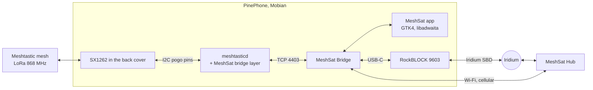

<picture>
  <source media="(prefers-color-scheme: dark)" srcset="docs/images/mark-dark.png">
  
</picture>

### MeshSat for Linux phones: the LoRa back cover as a node, the Bridge in your pocket, one package.

[Install](docs/INSTALL.md) ·
[The node](https://github.com/meshsat/meshsat-lora-backplate) ·
[The Bridge](https://github.com/meshsat/meshsat) ·
[What is proven](#what-is-proven-and-what-is-not) ·
[meshsat.net](https://meshsat.net)

A PinePhone with the Pine64 LoRa back cover can be a Meshtastic node by itself, and with the MeshSat Bridge running beside the node it becomes a router between the LoRa mesh, a satellite modem on USB-C and the MeshSat Hub. This repository packages all of it for Linux phones: one `.deb`, installed with one command, with the Bridge's interface as an app in the phone's app grid.

> **Status: pre-release.** This is a prototype under active development, not a finished product. The node and the Bridge are proven on one phone on one bench, at **0 dBm only**: the back cover's radio runs on a plain crystal that drifts as the amplifier heats, so long frames fail from 5 dBm up and the phone cannot receive for some seconds after each transmission. A radio that stops answering has to be re-seated by hand. The package has never been installed by anyone but its authors and has never been used in an actual emergency. See [What is proven, and what is not](#what-is-proven-and-what-is-not) before you rely on it for anything.

## How it fits together

## What is here

- [`docs/INSTALL.md`](docs/INSTALL.md): the one command, the optional Hub key and satellite modem, what the node does and does not do.
- `app/`: the MeshSat app, Python with GTK4, libadwaita and WebKitGTK: the Bridge's interface in a window sized for a phone, with a status page while a service is down, and an icon in the app grid (`.desktop` and AppStream metadata under `package/`).
- `package/`: the Debian package's control files, maintainer scripts and static files; `build-deb.sh` assembles the package from the node sources of [meshsat-lora-backplate](https://github.com/meshsat/meshsat-lora-backplate) at a pinned commit, a daemon built on a phone from [meshsat-firmware](https://github.com/meshsat/meshsat-firmware), the Bridge from [meshsat](https://github.com/meshsat/meshsat)'s pipeline, and Meshtastic's web client release. No gateway logic lives here.
- The package's units: `meshtasticd.service` (the node), `meshsat-radio-watch.timer` (the watchdog that tells a user to re-seat a cover whose radio stopped answering, and starts the node again when it answers), `meshsat-bridge.service` (the Bridge, over TCP to the node).

## What is proven, and what is not

| | State |
|---|---|
| The package installs with one command on a Mobian PinePhone Pro and starts the node, the watchdog and the Bridge | see the release notes of the first release |
| The MeshSat icon in the app grid opens the Bridge's interface | see the release notes of the first release |
| The node: texts both ways with a T-Deck at 0 dBm | **Yes**, 28 Sep 2026, on the bench of meshsat-lora-backplate |
| The Bridge talks to the node over TCP | **Yes**, against a fake daemon in the Bridge's tests; on the phone: see the release notes |
| A text from the mesh reaches the Hub through the phone | **Not yet**: needs a Hub API key on the phone |
| A text from the mesh reaches the satellite through the phone | **Not yet**: needs the RockBLOCK on USB-C |
| Transmit above 0 dBm | **No**, a hardware limit of the back cover until its crystal is replaced by a TCXO |
| Use without a person nearby | **Not possible** as long as only a hand can reset a radio that stopped answering |
| Published in an app store or an apt repository | **No**, not before a text has gone from the phone to the satellite |
| Deployment to a real end user, use in an actual emergency | **Never** |

## Related projects

- **[meshsat-lora-backplate](https://github.com/meshsat/meshsat-lora-backplate)**, the back cover as a Meshtastic node: the bridge layer, the measurements, the node packaging this package vendors
- **[MeshSat Bridge](https://github.com/meshsat/meshsat)**, the gateway software this package runs on the phone
- **[MeshSat Android](https://github.com/meshsat/meshsat-android)** and **[MeshSat iOS](https://github.com/meshsat/meshsat-ios)**, the same idea on phones that are not Linux
- **[MeshSat Hub](https://hub.meshsat.net)**, where the messages end up

## Licence

GPL-3.0, like the rest of MeshSat. Meshtastic is a registered trademark of Meshtastic LLC; this project is not affiliated with it.
